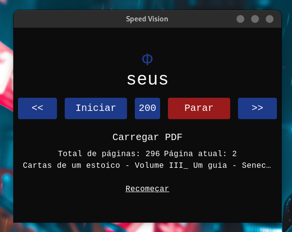

# Speed Vision



Speed Vision é um aplicativo de leitura rápida que ajuda os usuários a aumentarem sua velocidade de leitura e compreensão através de uma interface intuitiva e simplificada. Desenvolvido com React, TailwindCSS, Speed Vision é uma aplicação desktop.

## Características

- **Multiplataforma**: Disponível para Windows, macOS e Linux.

## Início Rápido

Para iniciar com o Speed Vision, siga os passos abaixo:

1. Clone o repositório:
   ```bash
   git clone https://link-para-o-repositorio.com/speed-vision.git

2. Instale as dependências:
    ```bash
    cd speed-vision
    npm install

3. Execute o aplicativo:
    ``` bash
    npm run tauri dev

## Construção do Aplicativo

Para construir uma versão de produção do Speed Vision, execute:
```bash
    npm run tauri build
```
Os artefatos de construção serão encontrados no diretório src-tauri/target/release.
